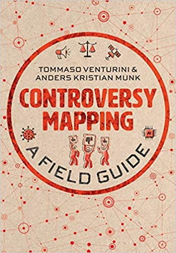

```{r, echo=FALSE}
library(metathis)
meta() %>% 
  meta_description(params$event) %>% 
  meta_name("github-repo" = paste0("datactivist/", params$slug)) %>% 
  meta_viewport() %>% 
  meta_social(
    title = params$title,
    url = paste0("https://datactivist.coop/", params$slug),
    image = params$image,
    image_alt = params$image_alt,
    og_type = "website",
    og_author = "Datactivist",
    og_locale = "fr_FR",
    og_site_name = "Datactivist",
    twitter_card_type = "summary",
    twitter_creator = "@datactivi_st")

```

layout: true

<style>
.remark-slide-number {
  position: inherit;
}

.remark-slide-number .progress-bar-container {
  position: absolute;
  bottom: 0;
  height: 4px;
  display: block;
  left: 0;
  right: 0;
}

.remark-slide-number .progress-bar {
  height: 100%;
  background-color: #e95459;
}

</style>


`r paste0("<div class='my-footer'><span>", params$event, "</span> <center><div class=logo><a href='https://datactivist.coop/'></a></div></center></span></div>")` 


---

class: center, middle

Ces slides en ligne : `r paste0("http://samgoeta.github.io/", params$slug)`

Sources : `r paste0("https://github.com/samgoeta/", params$slug)`


Cette production est librement réutilisables selon les termes de la licence [Creative Commons 4.0 BY-SA](https://creativecommons.org/licenses/by-sa/4.0/legalcode.fr).

<BR>
<BR>


---

class: center, middle




Une grande partie des contenus de ce cours est tiré du livre _[Controversy Mapping: A field guide](https://cis.cnrs.fr/controversy-mapping-a-field-guide/)_ de Tommaso Venturini et Ander Kristian Munk, 2022, éditions Munk.


---
class:inverse, middle, center

## Contexte et enjeux
---
background-image: url("img/london.jpeg")

### Une controverse ?


Un terme au départ issu de la théologie, devenu synonyme de **débat** : 

> "Discussion argumentée, contestation sur une opinion, un problème, un phénomène ou un fait; p. méton. ensemble des éléments divergents ou contradictoires du débat."

--

À distinguer d'une **polémique** où les arguments s'estompent pour se concentrer sur la forme violente :

> " Discussion, débat, controverse qui traduit de façon violente ou passionnée, et le plus souvent par écrit, des opinions contraires sur toutes espèces de sujets (politique, scientifique, littéraire, religieux, etc.); genre dont relèvent ces discussions."

De fait, **toute polémique n'est pas une controverse.** Il ne suffit pas qu'un sujet fasse scandale pour qu'il y ait controverse.  

.footnote[[TLF](http://stella.atilf.fr/Dendien/scripts/tlfiv5/advanced.exe?8;s=2439947865;)]

---

### Le rôle croissant des sciences et techniques en politique 

Les sujets liés aux sciences et techniques occupent une part importante des débats politiques et d'actualité.

--

#### Exercice

##### Identifiez en 5 minutes 20 sujets d'actualité liés aux sciences et techniques 

--

Face à ces enjeux qui mobilisent une expertise de plus en plus grande, les politiques publiques libérales ont érigé la figure d'un citoyen rationnel, informé, curieux capables de saisir la technicité des enjeux et de prendre les bonnes décisions pour protéger l'environnement et ses conditions de vie (Barry, 2001). Cette figure est théorique, il est impossible de suivre la course effrénée des sciences et techniques alors que se posent des questions politiques essentielles.


---

#### Aux origines de la cartographie de controverse
### La théorie de l'acteur-réseau


.footnote[Source : E Sayes, « Actor-Network Theory and methodology: Just what does it mean to say that nonhumans have agency? », Social Studies of Science,2013, vol. 44, n° 1, p. 134‑149.]

La cartographie de controverse s'est développée en s'appuyant sur **la théorie de l'Acteur Réseau (ou ANT comme _Actor Network Theory_) **. Au sein des _Science and Technology Studies_, ce courant de recherche développé depuis les années 80 par des chercheurs comme Bruno Latour, Michel Callon, Madeleine Akrich ou John Law considère les "non-humains" non pas comme des objets mais comme des **sujets**, capables d'agentivité. 

Les non-humains autorisent, permettent, suggèrent, influencent, bloquent, rendent possible, interdisent certains comportements. 

Sans enlever toute distinction entre humains et non-humains, elle nous invite à considérer les non-humains comme des acteurs essentiels de la sociologie. Chaque acteur ne peut agir qu'en "réseau" même s'il n'a pas forcément d'intentionnalité.


---

#### Aux origines de la cartographie de controverse
### Les Digital Methods


Autre source de la cartographie de controverse : les _Digital Methods_, un courant de recherche né au début des années 2000 notamment à l'université d'Amsterdam qui développe des méthodes d'analyse en sciences sociales basée sur l'étude de données en ligne. 

Ce courant, très proche de celui des _Digital Humanities_, s'est développé du fait de la grande disponibilité de données numériques à disposition des chercheurs. 

Il vise à réduire la frontière entre recherche quantitative et recherche qualitative. 

---
class:inverse, middle

.pull-left[


]

.pull-right[

### Exercice : repérer les non-humains

#### Listez tous les non-humains présents dans cette une du _Monde_


]

---

### La transformation des infrastructures du débat public

.pull-left[

* Une variété de plus en plus grande d'acteurs prennent part aux controverses qui se développent dans l'espace public. 

* Les médias en ligne rendent le débat potentiellement plus démocratique, mais aussi plus complexe et facile à manipuler. 

]

.pull-right[


]


* Les algorithmes de filtrage et de sélection des réseaux sociaux valorisent le conflit. Les controverses attirent l'intérêt. 
Ne pas oublier le rôle des chaines d'information en continu !

---
class:inverse

### Le fonctionnement de l'algorithme de Twitter

<iframe width="800" height="500" src="https://www.youtube.com/embed/euqCkQJelB4" title="YouTube video player" frameborder="0" allow="accelerometer; autoplay; clipboard-write; encrypted-media; gyroscope; picture-in-picture" allowfullscreen></iframe>

---
class:inverse, middle, center

## Les règles de la cartographie de controverse

---
### Résister aux conceptions .red[réalistes] et .red[relativistes] du pouvoir et de la vérité

.pull-left[

#### .red[Réalisme]
* La vérité est "là", elle est prête à être découverte

* Quand notre connaissance du monde s'étend, s'étend aussi notre capacité à régler les controverses.
]

.pull-right[

#### .red[Relativisme]

* La vérité n'est que ce qui est admis à un moment dans le temps. 

* Les controverses ne peuvent pas être résolues car toutes les vérités sont temporaires. Il n'y a pas d'intérêt à débattre.
]

--
#### .red[L'analyse de controverse :]
Le pouvoir et le savoir étant co-produits, il faut observer les controverses car ce sont des moments essentiels de construction du monde. 

---


### Le serment du cartographe de controverse

.pull-left[
* **Je suivrai les acteurs**, je ne vais pas ignorer les voix avec lesquelles je ne suis pas d'accord. 
* **Je pondérerai les acteurs**, je donnerai de une visibilité aux acteurs proportionnelle à leur poids dans le débat.
* **J'indiquerai ma position**, je ne prétendrai pas à être désintéressé et cacher mon opinion. 
* **Je resterai dans le flou**, je ne chercherai pas à réduire la complexité de la controverse. 

]
--
.pull-right[

* **Je suivrai le medium**, je m'appuierai sur la publicité des propos tout en prenant en compte l'impact du medium sur la diffusion de la controverse. 
* **Je produirai des cartographies intelligibles** qui sont des simplications nécessaires en étant précautionneux, transparent, respectueux…
* **J'ouvrirai mon enquête aux autres**, j'ouvrirai mon code et mes données tant que possible et j'inviterai les acteurs à en débattre. 

]

---
### Choisir un bon sujet de cartographie de controverse

Venturini et Munk proposent une grille d'analyse en 4 critères : 


---
### Choisir un bon sujet de cartographie de controverse


* **Binaire** (une position établie est débattue par une minorité sceptique) vs **multiple** (une multitude de positions débattent sans qu'une s'impose) : une controverse n'est toutefois jamais vraiment binaire

* **Froide** (la controverse n'est plus d'actualité, une position s'est imposée) vs **chaude** (en train d'être débattue, pas encore résolue) : on risque de "naturaliser" le résultat de celle-ci si elle est refroidie et de ne pas envisager d'autres résultats possibles.

* **Ordinaire** (commun, grand public, sans grande spécialisation) vs **spécialisé** (débat d'experts ou de recherche) : ne pas confondre la vivacité d'une controverse et sa popularité, chercher plutôt des discussions spécialisées avec une composante experte

* **Secret** (dans des arènes hors de notre portée) vs **accessible** (à notre portée, disponible) : privilégier les controverses acccessibles mais ne pas négliger les sources hors-ligne (presse écrite, presse spécialisée, TV, radio…), l'observation de terrain et les entretiens.

---
class:inverse, middle, center
# Merci !
